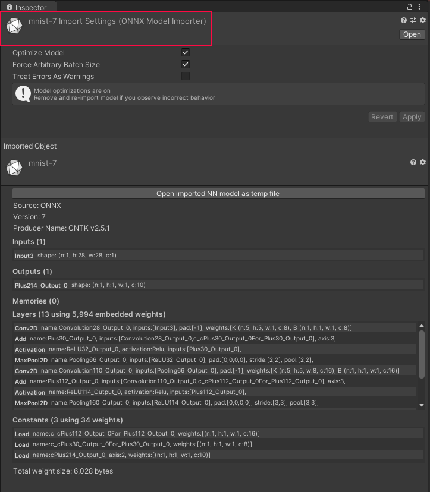

# Getting started with Barracuda

This guide provides a brief overview on how to use Barracuda and run neural networks in Unity.

Barracuda is an inference library. It allows you to execute a pre-trained neural network in Unity. To integrate Barracuda into your project:
1. Export your neural net from its Pytorch, TensorFlow or Keras framework to the [ONNX](https://onnx.ai) file format.
1. Add the .onnx file to your project: it behaves like a regular asset.
1. Load the model from the asset.
1. Create the inference engine (the worker).
1. Execute the model.
1. Fetch the results.


## Loading your neural network

Loading a trained model is divided into two steps:
1. Exporting a trained model from an external tool like Pytorch, TensorFlow or Keras to ONNX format. For information on how to export your existing model to this format, see [Exporting](Exporting.md).
2. Importing and loading the ONNX asset into Barracuda. 

To load an ONNX model, add its .onnx file to your project's `Asset` folder. The model is imported and shows up as an asset of type `NNModel`.

 




You can then reference this asset directly in your script as follows:

```Csharp
public NNModel modelAsset;
```

This allows you to assign a specific asset in the Editor UI. 

A model is an asset wrapper. It stores the model in binary format. Load and compile it into a run-time model (of type `Model`) like this:

```Csharp
public NNModel modelAsset;
private Model m_RuntimeModel;

void Start()
{	
    m_RuntimeModel = ModelLoader.Load(modelAsset);
}    
```

## Running your neural network


#### Creating the inference engine (Worker)
The core interface into the Barracuda engine is called `IWorker`.  A `Worker` breaks down the model into executable tasks and schedules them on the GPU or CPU. See the list of [Supported platforms](SupportedPlatforms.md).


```Csharp
var worker = WorkerFactory.CreateWorker(<WorkerFactory.Type>, m_RuntimeModel);   
```
For more details see [Using IWorker interface](Worker.md).

#### Executing the model
When you have loaded the model and created the `IWorker` interface, you can execute the model. You can provide inputs either as a sole `Tensor` object (if the model has a single input) or as a dictionary of name and `Tensor` pairs. 

For the single input scenario:
```Csharp	
    Tensor input = new Tensor(batch, height, width, channels); 
    worker.Execute(input);
```

If your network requires multiple inputs, place them into a `Dictionary` using the input name as a key:
```Csharp
    var inputs = new Dictionary<string, Tensor>();
    inputs[name1] = new Tensor(batch, height1, width1, channels1);
    inputs[name2] = new Tensor(batch, height2, width2, channels2);
    worker.Execute(inputs);
```
For more details on how to manipulate and initialize `Tensors` see [Handling data](TensorHandling.md).

Execution is asynchronous for GPU backends. Execution is also asynchronous for a CPU-Burst worker but synchronous for the rest of the CPU backends. For more detailed information see [Model execution](ModelExecution.md).


##  Fetching outputs

If the model has a single output, you can use `worker.PeekOutput()` . Otherwise, provide output names.
```Csharp
Tensor output = m_Worker.PeekOutput(outputName);
```
**Note:** `worker.PeekOutput()` returns the reference to the output tensor without transferring ownership to you. Calling `worker.PeekOutput()` guarantees that there are no additional memory allocations. However, it means that tensor values are lost after the next call to `worker.Execute()` or after the call to `worker.Dispose()`.

If you want to hold on to a tensor for a longer amount of time, call `worker.CopyOutput()` instead, but remember to `Dispose()` it after you are done.

Also, you must manually dispose all input tensors that you allocate.
For more detailed information see [Managing memory](MemoryManagment.md) and [Managing Barracuda outputs](ModelOutput.md).

## Putting it all together

By now your code should look like this:
```Csharp
public NNModel modelAsset;
private Model m_RuntimeModel;

void Start()
{	
    m_RuntimeModel = ModelLoader.Load(modelAsset);
    m_Worker = WorkerFactory.CreateWorker(<WorkerFactory.Type>, m_RuntimeModel);
}

void Update()
{
    Tensor input = new Tensor(batch, height, width, channels); 
    m_Worker.Execute(input);
    Tensor O = m_Worker.PeekOutput("output_layer_name");
    input.Dispose();
}
```

## Advanced features

For information on advanced Barracuda features see:

* [Exporting to ONNX](Exporting.md)
* [Data handling](TensorHandling.md)
* [Memory management](MemoryManagement.md)
* [Model execution](ModelExecution.md)
* [IWorker interface](Worker.md)
* [Model outputs](ModelOutput.md)

