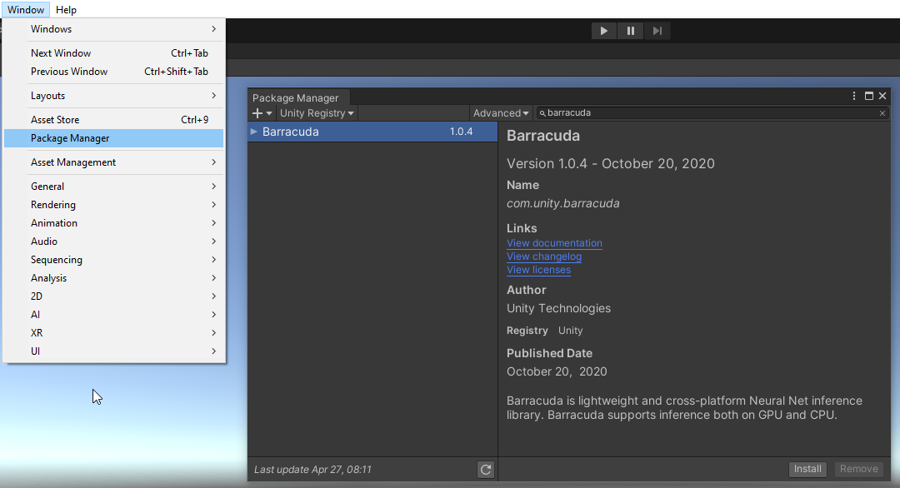
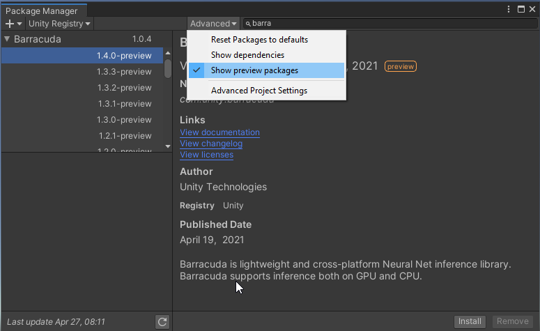
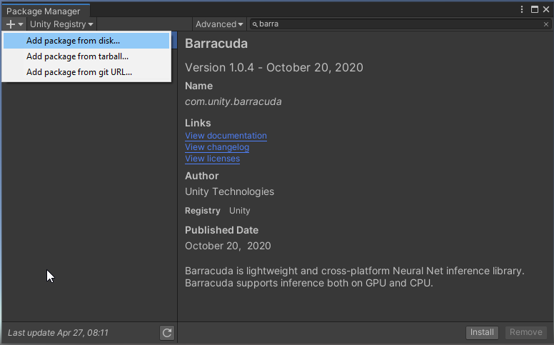

# Installing Barracuda

You can get Barracuda from: 
* Unity Package Manager
* GitHub

## Unity Package Manager

In the Unity Editor, open the [Package Manager window](https://docs.unity3d.com/Manual/upm-ui.html), select Barracuda and install it:




If you want a more recent (un-verified) version, enable `preview` packages:



Note: in Unity 2020.3 and later Barracuda is not visible in Package Manager. It still can be enabled by manually editing your project's `Packages/manifest.json` and adding `com.unity.barracuda` entry there.

## GitHub

If you want to edit source code or pull from a specific branch, it's best to clone the repository. There are two ways to do this:

* Edit your Unity project's `Packages/manifest.json` and add the following dependency to the Barracuda GitHub repo: 
```json
	"com.unity.barracuda" : "https://github.com/Unity-Technologies/barracuda-release.git[#<revision>]"
```
* If you have downloaded the repository, manually connect to it via the `Unity Package Manager`. To do this, open the Package Manager, select the **Add(+)** button, and select **Add package from disk**.



This is the `manifest.json` equivalence:

```json
"com.unity.barracuda": "file:<PATH_TO_BARRACUDA_FOLDER>/UnityProject/Assets/Barracuda"
```

## Resources

For more information, see the [Git URLS](https://docs.unity3d.com/Manual/upm-git.html) documentation.
