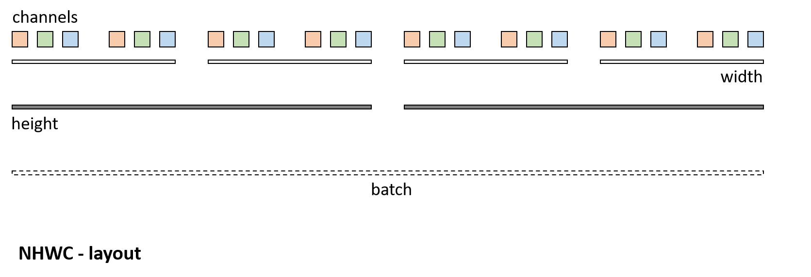

# Working with data

## Tensor
In Barracuda, Tensor values can be accessed using channels-last layout.

Four dimensional (or less) tensors should be prefered for performance reasons where possible. They can be accessed using `batch`, `height`, `width`, `channels` dimensions.

However up to 8 dimensional tensors are supported. The full set of supported dimensions is `sequence`, `direction`, `batch`, `extraDimension`, `depth`, `height`, `width`, `channels`.

Here is an exemple of Barracuda memory layout with a 4 dimensional NHWC tensor.

**Note:**  The native ONNX data layout is channels-first. Barracuda automatically converts ONNX models to channel-last layout.

### Data access

You can interact with `Tensor` data via multi-dimensional array operators:
```Csharp
var tensor4D = new Tensor(batchCount, height, width, channelCount);

// As N batches of 3 dimensional data: N x {H, W, C}
// ie accessing element at index [0,0,N,0,0,H,W,C] in this Tensor.
tensor4D[n, h, w, c] = 1.0f;

// As N batches of 1 dimensional data: N x {C}.
// ie accessing element at index [0,0,N,0,0,0,0,C] in this Tensor.
tensor4D[n,       c] = 2.0f; 

// As a flat array. 
// accessing element at offset `index` in this Tensor.
tensor4D[         i] = 3.0f;

// Additionally for tensor with more than 4D dimension one can access data using:
var tensor8D = new Tensor(new TensorShape(sequence, direction, batchCount, time, depth, height, width, channelCount));

// As SxRxN batches of 5 dimensional data: SxRxN x {T, D, H, W, C}
// ie accessing  element at index [S,R,N,T,D,H,W,C] in this Tensor.
tensor8D[s, r , n, t, d, h, w, c] = 1.0f;

// As N batches of 4 dimensional data: N x {D, H, W, C}
// ie accessing element at index [0,0,N,0,D,H,W,C] in this Tensor.
tensor8D[n, d, h, w, c] = 1.0f;
```

### Constructor
Multiple `Tensor` constructors cover a variety of scenarios up to 8 dimensions. By default tensors initialize with `0` upon construction, unless you provide an initialization `Array`:
```Csharp
// batch of 1 dimensional data, 0 initialized: batchCount x {elementCount}
tensor = new Tensor(batchCount, elementCount);
// batch of 3 dimensional data, 0 initialized: batchCount x {height, width, channelCount}
tensor = new Tensor(batchCount, height, width, channelCount);
// sequence * direction * batch of 5 dimensional data, 0 initialized: sequence * direction * batchCount x {time, depth, height, width, channelCount}
tensor = new Tensor(new TensorShape(sequence, direction, batchCount, time, depth, height, width, channelCount));
```
```Csharp
var stridedArray = new float[batchCount * elementCount] { ... };
// batch of 1 dimensional data, initialized from strided array
tensor = new Tensor(batchCount, elementCount, stridedArray);     
```
```Csharp
var jaggedArray = new float[batchCount][elementCount] { ... };
// batch of 1 dimensional data, initialized from jagged array
tensor = new Tensor(batchCount, elementCount, jaggedArray);      
```
```Csharp
Texture2D texture = ...;
// tensor initialized with texture data: 1 x { texture.width, texture.height, 3}
tensor = new Tensor(texture);                                    
```

You can query the shape of the `Tensor` object, but you cannot change the shape of the `Tensor`. If you need a different shape of `Tensor`, you must construct a new instance of the `Tensor` object:

```C#
var shape = tensor.shape;
Debug.Log(shape + " or " + shape.sequenceLength + shape.numberOfDirections + shape.batch + shape.extraDimension + shape.depth +shape.height + shape.width + shape.channels);
```

## Texture constructor
You can create a `Tensor` from an input `Texture` or save a `Tensor` to a `Texture` directly. 

**Note:** When you do this, pixel values are in the range [0,1]. Convert data accordingly if your network is expecting values between [0,255], for example.

### Texture as input
You can directly pass `Texture2D`, `Texture2DArray`, `Texture3D` or `RenderTexture` to Barracuda without accessing individual pixels on the CPU:
```Csharp
// you can treat input pixels as 1 (grayscale), 3 (color) or 4 (color with alpha) channels
var channelCount = 3; 
var tensor = new Tensor(texture, channelCount);
```
You can batch multiple textures into the single `Tensor` object:
```Csharp
// these textures form a batch
var textures = new [] { texture0, texture1, texture2, texture3 }; 
var tensor = new Tensor(textures, channelCount);
```
**Note:** All textures in a batch must have the same width and height dimensions.

### Texture as output
If you want to use Barracuda execution results further in the graphics pipeline, you can copy data from `Tensor` into a `RenderTexture` without stalling the CPU or GPU:
```Csharp
var tensor = worker.PeekOutput();
var texture = BarracudaTextureUtils.TensorToRenderTexture(tensor);
```
You can reuse the same `RenderTexture` multiple times:
```Csharp
var texture = new RenderTexture(width, height, 0);
// ...
tensor = worker.PeekOutput();
BarracudaTextureUtils.TensorToRenderTexture(tensor, texture);
```


## Cleanup
As a Barracuda user you are responsible for calling `Dispose()` on inputs, outputs and any data that you created, received via `worker.Fetch()` or have taken ownership of by calling `tensor.TakeOwnership()`.  

**Note:** This is necessary to free up GPU resources properly.

```C#
tensor.Dispose();
```
**Note:** You do not need to call `Dispose()` on tensors that you received via the ``worker.PeekOutput()`` call.