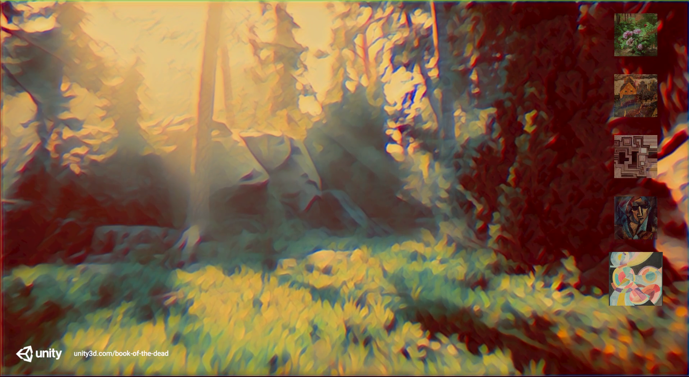

# Introduction to Barracuda

The Barracuda package is a lightweight cross-platform [neural network](https://en.wikipedia.org/wiki/Neural_network) inference library for Unity.  

Barracuda can run neural networks on both the GPU and CPU. For details, see [Supported platforms](SupportedPlatforms.md).

Currently Barracuda is production-ready for use with [machine learning (ML) agents](https://github.com/Unity-Technologies/ml-agents) and number of [other network architectures](SupportedArchitectures.md). When you use Barracuda in other scenarios, it is in the preview development stage.

# Getting started
This documentation assumes that you are familiar with neural networks and have already trained a network that needs to be integrated into a Unity-based project. 

Barracuda is a simple, developer-friendly API for neural network execution. You can start using Barracuda with as little code as this:

```Csharp
var model = ModelLoader.Load(filename);
var engine = WorkerFactory.CreateWorker(model, WorkerFactory.Device.GPU);

var input = new Tensor(1, 1, 1, 10);
var output = engine.Execute(input).PeekOutput();
```
The Barracuda neural network import pipeline is built on the [ONNX](https://onnx.ai/) (Open Neural Network Exchange) format, which lets you bring in neural network models from a variety of external frameworks, including Pytorch, TensorFlow, and Keras.

The [Getting started](GettingStarted.md) guide takes you through a short, complete tutorial on how to run your network in Unity with Barracuda. 

The [FAQ](FAQ.md) provides answers about the design, implementation, and usage of Barracuda.

# Advanced topics
This section provides more information on the following topics:

* [Supported operators](SupportedOperators.md): provides an overview of supported operators
* [Supported platforms](SupportedPlatforms.md): provides an overview of supported platforms
* [Supported architectures](SupportedArchitectures.md): provides an overview of supported architectures
* [Exporting model to ONNX](Exporting.md): explains how to export a network to ONNX
* [Loading model](Loading.md): explains how to load a ONNX network to Barracuda
* [Visualizing model](VisualizingModel.md): explains how to vizualize ONNX and Barracuda networks
* [Using IWorker interface](Worker.md): explains how to run your model on different backends
* [Model execution](ModelExecution.md): explains how to run a model
* [Model outputs](ModelOutput.md): explains how to introspect the model and query outputs
* [Tensors: handling data](TensorHandling.md): explains how to handle data in Barracuda
* [Memory management](MemoryManagement.md): explains how memory is managed in Barracuda 

## Reporting issues

If you have issues running Barracuda in your Unity project, please report them on the [Barracuda GitHub repository](https://github.com/Unity-Technologies/barracuda-release/issues).

## Requirements
The current version of Barracuda is compatible with the following versions of the Unity Editor:

* 2019.4.x and later

