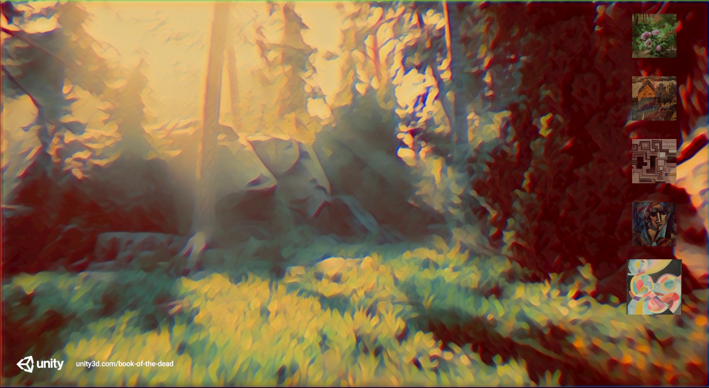

# Unity Barracuda

**Unity Barracuda** is a lightweight **cross-platform** Neural Networks **inference library for Unity**. \
Barracuda can run Neural Networks both on GPU and CPU. For details, please look for [Supported Platforms](Documentation~/SupportedPlatforms.md).

Currently Barracuda is production-ready for use with [machine learning (ML) agents](https://github.com/Unity-Technologies/ml-agents) and number of [other network architectures](Documentation~/SupportedArchitectures.md). When you use Barracuda in other scenarios, it is in the preview development stage.

# Installation

[Installing Barracuda](Documentation~/Installing.md) goes through how to install Barracuda, both locally and remotely. 

# Reporting issues

If you encounter issues running Barracuda in your Unity project, please report them on our [GitHub repo](https://github.com/Unity-Technologies/barracuda-release/issues).
